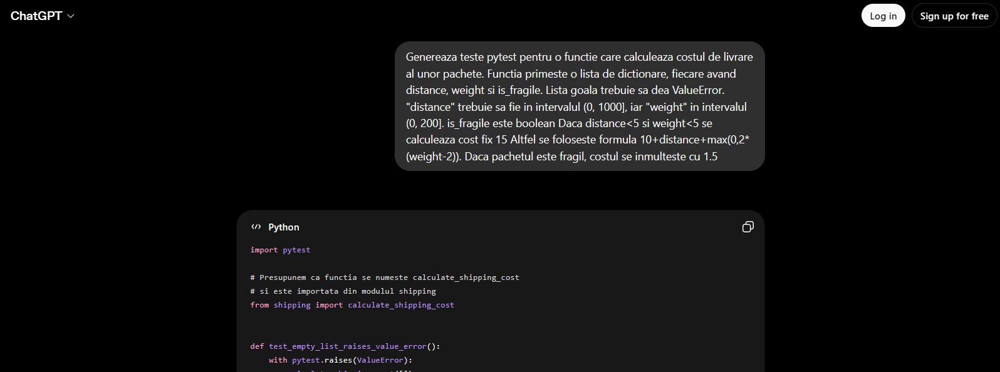
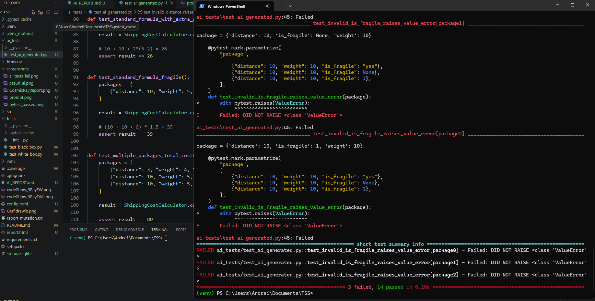
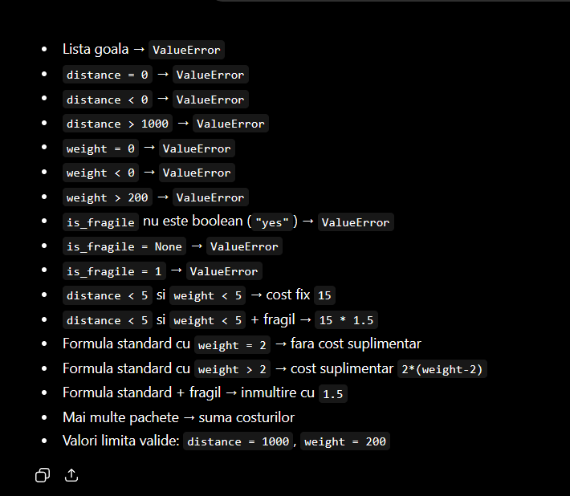

# AI Report - Utilizarea ChatGPT in timpul testarii software

## Cuprins

1. [Tool utilizat](#tool-utilizat)
2. [Scopul folosirii AI](#scopul-folosirii-ai)
3. [Prompt folosit](#prompt-folosit)
4. [Raspunsul urmarit](#raspunsul-urmarit)
5. [Comparatie intre testele generate de AI si testele proprii](#comparatie-intre-testele-generate-de-ai-si-testele-proprii)
6. [Ce a fost util si ce a trebuit corectat](#ce-a-fost-util-si-ce-a-trebuit-corectat)
7. [Capturi de ecran recomandate](#capturi-de-ecran-recomandate)
8. [Concluzie](#concluzie)
9. [Bibliografie](#bibliografie)

---

## Tool utilizat

Tool-ul AI folosit a fost:

```text
ChatGPT
```
---

## Scopul folosirii AI

ChatGPT a fost folosit pentru:

- generarea unor teste pentru descrierea metodei din proiect
- compararea acestor teste cu testele scrise manual
- verificarea unor idei de structurare a documentatiei
- formularea mai clara a unor explicatii

---

## Prompt folosit

Promptul care a fost folosit pentru comparatie este:

```text
Genereaza teste pytest pentru o functie care calculeaza costul de livrare al unor pachete. Functia primeste o lista de dictionare, fiecare avand distance, weight si is_fragile.
Lista goala trebuie sa dea ValueError.
"distance" trebuie sa fie in intervalul (0, 1000], iar "weight" in intervalul (0, 200]. is_fragile este boolean
Daca distance<5 si weight<5 se calculeaza cost fix 15
Altfel se foloseste formula 10+distance+max(0,2*(weight-2)).
Daca pachetul este fragil, costul se inmulteste cu 1.5
```





---

## Raspunsul urmarit

Rezultatul la care m-am asteptat au fost niste teste simple care verifica o parte din cerinte

- lista goala
- un pachet valid cu cost fix
- un pachet valid cu formula
- un pachet fragil
- date invalide pentru distanta sau greutate

Aceste teste sunt utile, dar nu garanteaza acoperirea tuturor cazurilor

---


## Codul generat de AI

```python
import pytest

# Presupunem ca functia se numeste calculate_shipping_cost
# si este importata din modulul shipping
from shipping import calculate_shipping_cost


def test_empty_list_raises_value_error():
    with pytest.raises(ValueError):
        calculate_shipping_cost([])


@pytest.mark.parametrize(
    "package",
    [
        {"distance": 0, "weight": 10, "is_fragile": False},
        {"distance": -1, "weight": 10, "is_fragile": False},
        {"distance": 1001, "weight": 10, "is_fragile": False},
    ],
)
def test_invalid_distance_raises_value_error(package):
    with pytest.raises(ValueError):
        calculate_shipping_cost([package])


@pytest.mark.parametrize(
    "package",
    [
        {"distance": 10, "weight": 0, "is_fragile": False},
        {"distance": 10, "weight": -5, "is_fragile": False},
        {"distance": 10, "weight": 201, "is_fragile": False},
    ],
)
def test_invalid_weight_raises_value_error(package):
    with pytest.raises(ValueError):
        calculate_shipping_cost([package])


@pytest.mark.parametrize(
    "package",
    [
        {"distance": 10, "weight": 10, "is_fragile": "yes"},
        {"distance": 10, "weight": 10, "is_fragile": None},
        {"distance": 10, "weight": 10, "is_fragile": 1},
    ],
)
def test_invalid_is_fragile_raises_value_error(package):
    with pytest.raises(ValueError):
        calculate_shipping_cost([package])


def test_small_distance_and_weight_fixed_cost():
    packages = [
        {"distance": 3, "weight": 4, "is_fragile": False}
    ]

    result = calculate_shipping_cost(packages)

    assert result == 15


def test_small_distance_and_weight_fixed_cost_fragile():
    packages = [
        {"distance": 3, "weight": 4, "is_fragile": True}
    ]

    result = calculate_shipping_cost(packages)

    assert result == 22.5


def test_standard_formula_without_extra_weight():
    packages = [
        {"distance": 10, "weight": 2, "is_fragile": False}
    ]

    result = calculate_shipping_cost(packages)

    # 10 + 10 + max(0, 2*(2-2)) = 20
    assert result == 20


def test_standard_formula_with_extra_weight():
    packages = [
        {"distance": 10, "weight": 5, "is_fragile": False}
    ]

    result = calculate_shipping_cost(packages)

    # 10 + 10 + 2*(5-2) = 26
    assert result == 26


def test_standard_formula_fragile():
    packages = [
        {"distance": 10, "weight": 5, "is_fragile": True}
    ]

    result = calculate_shipping_cost(packages)

    # (10 + 10 + 6) * 1.5 = 39
    assert result == 39


def test_multiple_packages_total_cost():
    packages = [
        {"distance": 3, "weight": 4, "is_fragile": False},   # 15
        {"distance": 10, "weight": 5, "is_fragile": False},  # 26
        {"distance": 10, "weight": 5, "is_fragile": True},   # 39
    ]

    result = calculate_shipping_cost(packages)

    assert result == 80


def test_boundary_values_are_valid():
    packages = [
        {"distance": 1000, "weight": 200, "is_fragile": False}
    ]

    result = calculate_shipping_cost(packages)

    expected = 10 + 1000 + 2 * (200 - 2)
    assert result == expected

```
## Comparatie intre testele generate de AI si testele proprii

| Criteriu | Teste generate de AI| Teste proprii |
|---|---|---|
| Caz pentru lista goala | Da | Da |
| Caz valid cu cost fix | Da | Da |
| Caz valid cu formula | Da | Da |
| Pachet fragil | Da | Da |
| Validari de intrare | Partial | Da |
| Partitionare in clase de echivalenta | Partial | Da |
| Analiza valorilor de frontiera | Partial | Da |
| Statement coverage | Partial | Da |
| Decision coverage | Partial | Da |
| Condition coverage | Partial | Da |
| Circuite independente | Nu | Da |
| Mutation testing | Nu | Da |


### Rulare
La rulare 3 teste nu au trecut


---

### Cazurile testate de AI


## Ce a fost util si ce a trebuit corectat

### Ce a fost util

AI-ul a fost folositor pentru ca a dat un rezultat rapid care poate ajuta ca punct de plecare, dar testele au trebuit verificate manual.


### Imbunatatiri
Pentru a se ajunge la un rezultat mai bun putem sa continuam cu un prompt cu mai multe indicatii catre AI unde sa cerem explicit ce dorim sa testam.


## Concluzie

ChatGPT a fost util ca tool de asistenta, mai ales pentru generarea unor idei initiale si pentru comparatie.

Comparatia arata ca testele generate de AI sunt mai generale, in timp ce testele proprii sunt mai aplicate si mai bine legate de specificatie, graf si criteriile de acoperire.

---

## Bibliografie

[1] OpenAI, ChatGPT, https://chatgpt.com/, Data generarii: 17 mai 2026.  
[2] Pytest Documentation, https://docs.pytest.org/, Data ultimei accesari: 3 mai 2026.  
[3] Cosmic Ray Documentation, https://cosmic-ray.readthedocs.io/, Data ultimei accesari: 17 mai 2026.  
[4] Materiale de curs si laborator, Testarea Sistemelor Software, 2026.  
