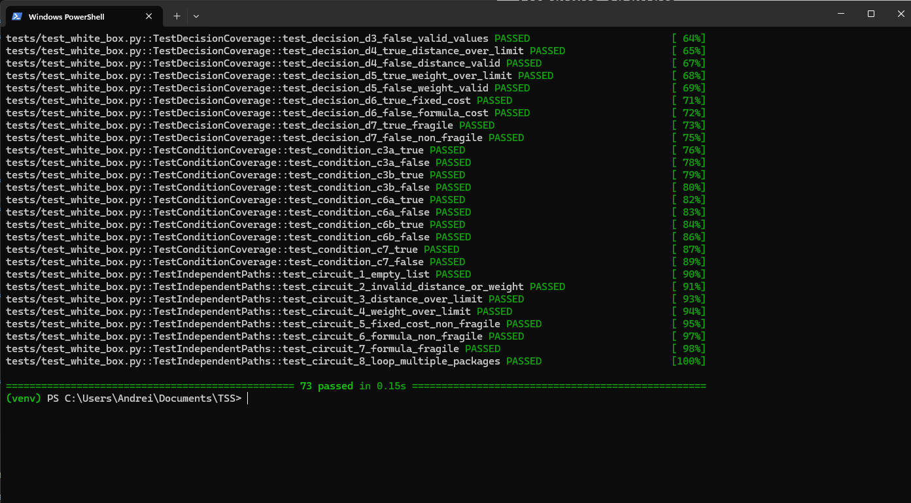
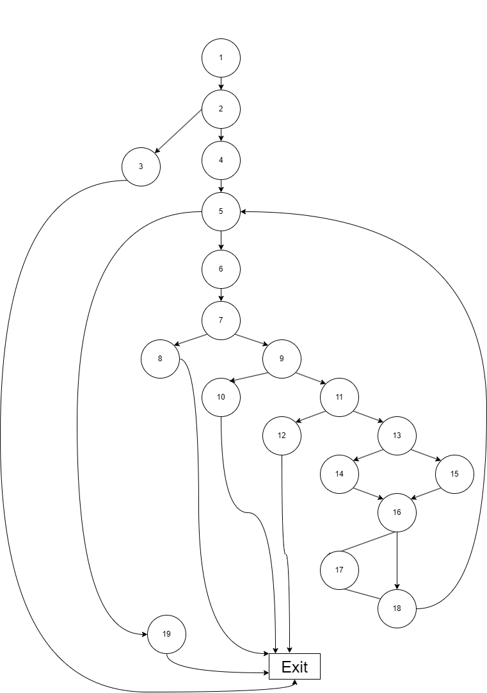
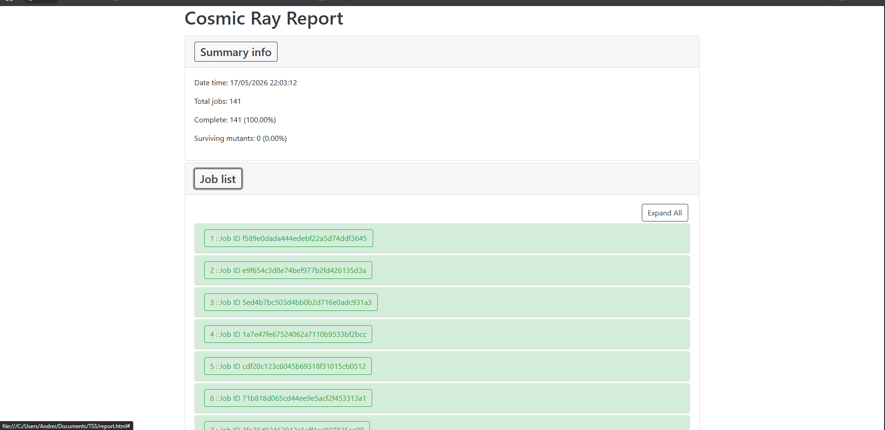

# Shipping Cost Calculator - Testarea Sistemelor Software

## Autor si tema

**Autor:** Ionescu Dumitru Andrei  
**Grupa:** 342  
**Tema aleasa:** T1 - Testare unitara in Python  

---

## Cuprins

1. [Descrierea proiectului](#descrierea-proiectului)
2. [Structura proiectului](#structura-proiectului)
3. [Configuratie hardware si software](#configuratie-hardware-si-software)
4. [Rulare proiect si teste](#rulare-proiect-si-teste)
5. [Functia testata](#functia-testata)
6. [Testare functionala](#testare-functionala)
7. [Testare structurala](#testare-structurala)
8. [Mutation testing cu Cosmic Ray](#mutation-testing-cu-cosmic-ray)
9. [Rezultate obtinute](#rezultate-obtinute)
10. [Capturi de ecran si demo](#capturi-de-ecran-si-demo)
11. [Raport despre utilizarea AI](#raport-despre-utilizarea-ai)
12. [Concluzii](#concluzii)
13. [Bibliografie](#bibliografie)

---

## Descrierea proiectului

Proiectul implementeaza si testeaza o clasa Python care calculeaza costul de livrare pentru o lista de pachete. 
Costul depinde de:

- distanta de livrare
- greutatea coletului
- faptul ca pachetul este fragil sau nu

Pentru testele unitare a fost folosit `pytest`, iar pentru mutation testing a fost folosit `Cosmic Ray`.

---

## Structura proiectului

Structura relevanta a proiectului este:

```text
TSS/
├── src/
│   └── shipping_cost_calculator.py
├── tests/
│   ├── teste black-box
│   └── teste white-box
├── config.toml
├── storage.sqlite
├── report.html
├── README.md
└── AI_REPORT.md
```
---

## Configuratie hardware si software

### Configuratie hardware

| Componenta | Valoare |
|---|---|
| Procesor | Ryzen 7 |
| Memorie RAM | 32GB |
| Stocare | SSD |
| Sistem de operare | Windows 11 |
| Masina virtuala | Nu |

### Configuratie software

| Componenta | Valoare |
|---|---|
| Limbaj | Python 3.14.2 |
| Framework de testare | pytest 9.0.3 |
| Mutation testing | Cosmic Ray 8.4.6 |
| Editor / IDE | VS Code |
| Tool pentru graf | draw.io |
| Version control | Git |


---

## Rulare proiect si teste

### Instalare dependinte

```bash
pip install pytest cosmic-ray
```

### Rulare teste

```bash
pytest tests/ -v
```

In ultima rulare completa a suitei de teste au fost obtinute:

```text
73 passed
```

### Rulare Cosmic Ray

```bash
cosmic-ray init config.toml storage.sqlite
cosmic-ray exec config.toml storage.sqlite
cr-report storage.sqlite --show-diff
cr-html storage.sqlite > report.html
```

---

## Functia testata

Functia principala este:

```python
ShippingCostCalculator.calculate_cost(packages, base_fee=15.0, fragile_multiplier=1.5)
```

Ea primeste o lista de pachete, iar fiecare pachet este reprezentat prin:

```python
{
    "distance": distance,
    "weight": weight,
    "is_fragile": is_fragile
}
```

### Reguli de functionare

- daca lista este goala, se arunca `ValueError`
- daca `distance <= 0` sau `weight <= 0`, se arunca `ValueError`
- daca `distance > 1000`, se arunca `ValueError`
- daca `weight > 200`, se arunca `ValueError`
- daca `distance < 5` si `weight < 5`, se aplica tariful fix `base_fee`
- in rest, se foloseste formula:

```text
base_cost = 10.0 + distance + max(0, 2.0 * (weight - 2))
```

- daca pachetul este fragil, costul se inmulteste cu `fragile_multiplier`
- la final se returneaza costul total pentru toate pachetele

---

## Testare functionala


### 1. Partitionare in clase de echivalenta

Au fost identificate clase de echivalenta pentru:

- lista de pachete
- distanta
- greutate
- fragilitate

Exemple de clase utilizate:

```text
L_1 = lista nevida
L_2 = lista goala

D_1 = {d | 0 < d < 5}
D_2 = {d | 5 <= d <= 1000}
D_3 = {d | d <= 0}
D_4 = {d | d > 1000}

W_1 = {w | 0 < w < 5}
W_2 = {w | 5 <= w <= 200}
W_3 = {w | w <= 0}
W_4 = {w | w > 200}

F_1 = {False}
F_2 = {True}
```

Clasele globale si reprezentantii concreti sunt descrisi direct in fisierul de teste black-box, impreuna cu tuplele utilizate la fiecare test

### 2. Analiza valorilor de frontiera


Pentru `distance` au fost folosite valori precum:

```text
0, 0.01, 4.99, 5.0, 5.01, 1000, 1000.01
```

Pentru `weight` au fost folosite valori precum:

```text
0, 1.99, 2.0, 2.01, 4.99, 5.0, 200, 200.01
```

Pragul `2` pentru greutate a fost verificat deoarece apare direct in formula de calcul:

```text
max(0, 2.0 * (weight - 2))
```

Boundary value analysis este importanta deoarece multe defecte apar exact la trecerea dintre intervale valide si invalide

---

## Testare structurala

Testarea structurala a urmarit codul sursa si graful de control asociat functiei

### Graful de control

Graful a fost realizat in draw.io, folosind noduri pentru instructiuni, decizii si bucla `for`.

Nodurile utilizate sunt:

| Nod | Semnificatie |
|---|---|
| N1 | start |
| N2 | verificare `len(packages) == 0` |
| N3 | `raise ValueError` pentru lista goala |
| N4 | initializare `total_cost = 0.0` |
| N5 | bucla `for pkg in packages` |
| N6 | extragere `distance`, `weight`, `is_fragile` |
| N7 | verificare `distance <= 0 or weight <= 0` |
| N8 | `raise ValueError` pentru valori invalide |
| N9 | verificare `distance > 1000` |
| N10 | `raise ValueError` pentru distanta prea mare |
| N11 | verificare `weight > 200` |
| N12 | `raise ValueError` pentru greutate prea mare |
| N13 | verificare `distance < 5 and weight < 5` |
| N14 | cost fix |
| N15 | cost calculat prin formula |
| N16 | verificare `is_fragile` |
| N17 | aplicare multiplicator de fragilitate |
| N18 | adaugare la `total_cost` |
| N19 | `return total_cost` |
| Exit | iesirea comuna din functie |

### Statement coverage

Pentru acoperirea la nivel de instructiune au fost definite teste care parcurg:

- lista goala
- valori invalide
- distanta peste limita
- greutate peste limita
- cost fix
- formula standard
- formula pentru pachet fragil

Prin aceste teste, fiecare instructiune importanta din graf este executata cel putin o data

### Decision coverage

Au fost analizate urmatoarele decizii:

```text
D1: len(packages) == 0
D2: for pkg in packages
D3: distance <= 0 or weight <= 0
D4: distance > 1000
D5: weight > 200
D6: distance < 5 and weight < 5
D7: is_fragile
```

Pentru fiecare decizie au fost create teste separate pentru ramurile `True` si `False`, astfel incat rezultatul sa fie usor de urmarit in codul de test.

### Condition coverage

Pentru conditiile compuse au fost urmarite separat valorile individuale:

```text
D3:
- distance <= 0
- weight <= 0

D6:
- distance < 5
- weight < 5
```

A fost analizata si conditia simpla:

```text
D7:
- is_fragile
```

### Circuite independente

Complexitatea ciclomatica a fost calculata cu formula prezentata la curs [3]:

```text
V(G) = e - n + 2
```

Pentru graful construit:

```text
n = 20
e = 26
V(G) = 26 - 20 + 2 = 8
```

Rezulta `8` circuite independente.

Acestea acopera:

1. lista goala
2. date invalide pentru distanta sau greutate
3. distanta mai mare de `1000`
4. greutate mai mare de `200`
5. cost fix pentru pachet nefragil
6. formula standard pentru pachet nefragil
7. formula standard pentru pachet fragil
8. revenirea in bucla `for` pentru procesarea mai multor pachete

---

## Mutation testing cu Cosmic Ray


### Rezultatul rularii

```text
total jobs: 141
complete: 141 (100.00%)
surviving mutants: 0 (0.00%)
```

### Interpretare

Au fost generati `141` de mutanti, iar toti au fost omorati de testele existente. 

### Exemple de mutanti detectati

#### Mutant 1 - validare input

```text
if distance <= 0 or weight <= 0
->
if distance >= 0 or weight <= 0
```

#### Mutant 2 - limita distantei

```text
if distance > 1000
->
if distance == 1000
```


#### Mutant 3 - fragilitate

```text
if is_fragile
->
if not is_fragile
```


Raportul complet generat de Cosmic Ray poate fi consultat in fisierul `report.html`.

---

## Rezultate obtinute

| Zona verificata | Rezultat |
|---|---|
| Teste unitare | `73 passed` |
| Circuite independente | `8` |
| Mutation testing | `141` mutanti, `0` supravietuitori |

---

## Capturi de ecran si demo

### Capturi de ecran
#### teste rulate


#### CFG 


#### Raport Cosmic Ray



### Videoclip demo
- link demo aplicatiei: [Link Video](https://drive.google.com/file/d/1p8sjov2sCiDB7K3mC_oFyqesFRGodywV/view?usp=sharing)

---

## Raport despre utilizarea AI

Raportul despre folosirea unui tool AI este disponibil in:

[`AI_REPORT.md`](AI_REPORT.md)

---

## Concluzii

In cadrul proiectului au fost acoperite urmatoarele:

- implementarea unei clase testate in Python
- testare functionala pe baza specificatiei
- partitionare in clase de echivalenta
- analiza valorilor de frontiera
- testare structurala
- statement coverage, decision coverage si condition coverage
- calculul circuitelor independente
- mutation testing cu Cosmic Ray

Aceste rezultate arata ca suita de teste acopera principalele cazuri cerute.

---

## Bibliografie

[1] Pytest Documentation, https://docs.pytest.org/, Data ultimei accesari: 3 mai 2026.  
[2] Cosmic Ray Documentation, https://cosmic-ray.readthedocs.io/, Data ultimei accesari: 17 mai 2026.  
[3] Materiale de curs si laborator, Testarea Sistemelor Software, 2026.  
[4] OpenAI, ChatGPT, https://chatgpt.com/, Data generarii: 17 mai 2026.  
